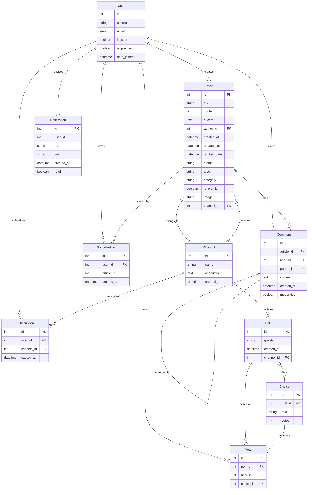
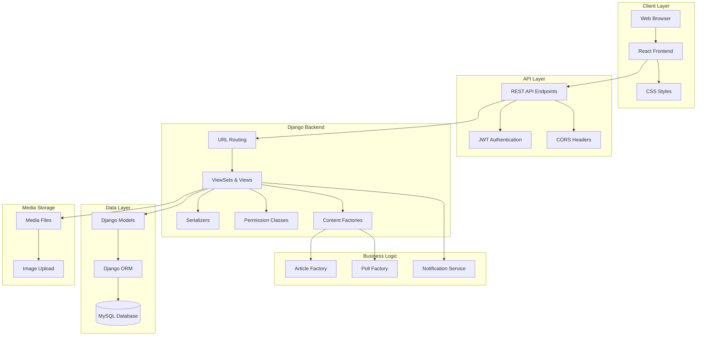
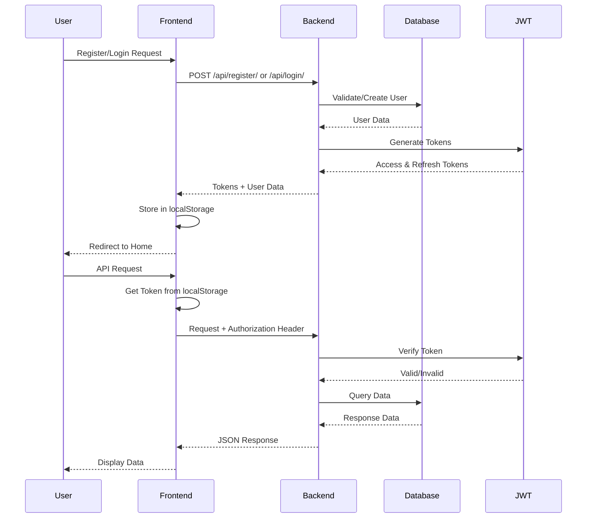
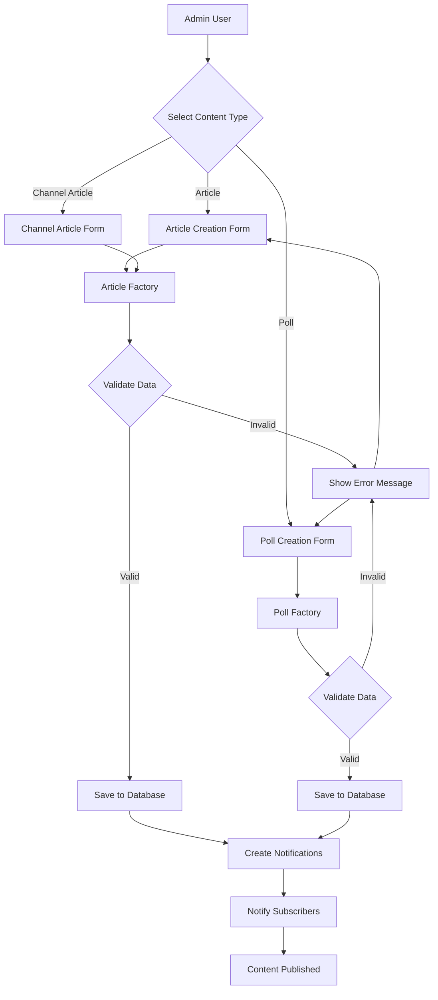
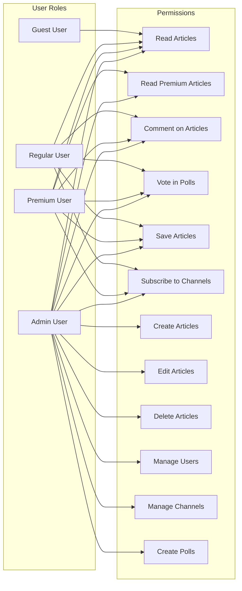
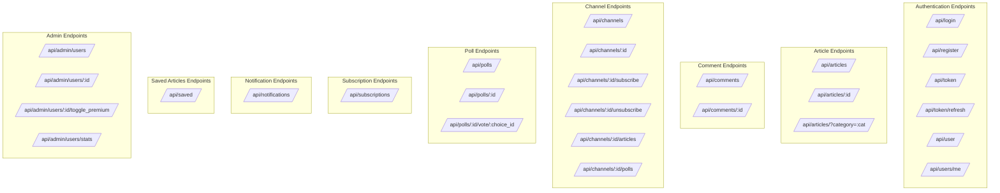

# Project Architecture Diagrams

This document contains Mermaid diagrams describing the architecture of the Magazine/News Platform project.

## 1. Database Schema (ER Diagram)

## 2. Backend API Architecture

```mermaid
graph TB
    subgraph "Django REST Framework"
        Router[DefaultRouter]
        
        subgraph "ViewSets"
            ArticleVS[ArticleViewSet]
            CommentVS[CommentViewSet]
            ChannelVS[ChannelViewSet]
            SubscriptionVS[SubscriptionViewSet]
            NotificationVS[NotificationViewSet]
            SavedArticleVS[SavedArticleViewSet]
            PollVS[PollViewSet]
            UserVS[UserViewSet]
            AdminUserVS[UserManagementViewSet]
        end
        
        subgraph "API Views"
            RegisterView[RegisterView]
            EmailLoginView[EmailLoginView]
            CurrentUser[current_user]
            UserMeView[UserMeView]
            ChannelPollList[ChannelPollListView]
            CreateContent[CreateContentView]
        end
        
        subgraph "Serializers"
            ArticleSerializer[ArticleSerializer]
            CommentSerializer[CommentSerializer]
            ChannelSerializer[ChannelSerializer]
            PollSerializer[PollSerializer]
            UserSerializer[UserSerializer]
        end
        
        subgraph "Permissions"
            IsAuthenticated[IsAuthenticated]
            IsAdminUser[IsAdminUser]
            IsAuthenticatedOrReadOnly[IsAuthenticatedOrReadOnly]
            IsOwnerOrAdmin[IsOwnerOrAdmin]
            IsAdminOrReadOnly[IsAdminOrReadOnly]
            AllowVoteOrAdmin[AllowVoteOrAdmin]
        end
    end
    
    subgraph "Models"
        UserModel[User Model]
        ArticleModel[Article Model]
        CommentModel[Comment Model]
        ChannelModel[Channel Model]
        PollModel[Poll Model]
        VoteModel[Vote Model]
    end
    
    subgraph "Authentication"
        JWT[JWT Tokens]
        RefreshToken[Refresh Token]
    end
    
    Router --> ArticleVS
    Router --> CommentVS
    Router --> ChannelVS
    Router --> SubscriptionVS
    Router --> NotificationVS
    Router --> SavedArticleVS
    Router --> PollVS
    Router --> UserVS
    Router --> AdminUserVS
    
    ArticleVS --> ArticleSerializer
    CommentVS --> CommentSerializer
    ChannelVS --> ChannelSerializer
    PollVS --> PollSerializer
    UserVS --> UserSerializer
    
    ArticleVS --> IsAuthenticatedOrReadOnly
    CommentVS --> IsOwnerOrAdmin
    PollVS --> AllowVoteOrAdmin
    AdminUserVS --> IsAdminUser
    
    ArticleVS --> ArticleModel
    CommentVS --> CommentModel
    ChannelVS --> ChannelModel
    PollVS --> PollModel
    
    RegisterView --> UserModel
    EmailLoginView --> JWT
    RegisterView --> JWT
    
    ArticleModel --> UserModel
    CommentModel --> ArticleModel
    CommentModel --> UserModel
    PollModel --> ChannelModel
    VoteModel --> PollModel
    VoteModel --> UserModel
```

## 3. Frontend Component Architecture

```mermaid
graph TB
    subgraph "React App"
        App[App.js]
        Router[React Router]
        Navbar[Navbar Component]
    end
    
    subgraph "Authentication Pages"
        LoginPage[LoginPage]
        RegisterPage[RegisterPage]
    end
    
    subgraph "Article Pages"
        Home[Home Page]
        ArticlesPage[ArticlesPage]
        ArticlesList[ArticlesList]
        Sport[Sport Page]
        Fashion[Fashion Page]
        News[News Page]
        CreateArticlePage[CreateArticlePage]
        EditArticlePage[EditArticlePage]
        SavedPage[SavedPage]
        CommentsSection[CommentsSection]
    end
    
    subgraph "Channel Pages"
        Subscriptions[Subscriptions Page]
        ChannelContentPage[ChannelContentPage]
        CreateArticleChannelPage[CreateArticleChannelPage]
    end
    
    subgraph "Poll Pages"
        CreatePollPage[CreatePollPage]
    end
    
    subgraph "Admin Pages"
        AdminUserManagementPage[AdminUserManagementPage]
    end
    
    subgraph "State Management"
        LocalStorage[localStorage]
        useState[useState Hooks]
        useEffect[useEffect Hooks]
    end
    
    subgraph "API Services"
        FetchAPI[Fetch API]
        APIEndpoints[API Endpoints]
    end
    
    App --> Router
    Router --> Navbar
    Router --> LoginPage
    Router --> RegisterPage
    Router --> Home
    Router --> ArticlesPage
    Router --> CreateArticlePage
    Router --> EditArticlePage
    Router --> Subscriptions
    Router --> SavedPage
    Router --> CreatePollPage
    Router --> AdminUserManagementPage
    
    ArticlesPage --> ArticlesList
    ArticlesPage --> CommentsSection
    
    Subscriptions --> ChannelContentPage
    Subscriptions --> CreateArticleChannelPage
    
    LoginPage --> LocalStorage
    RegisterPage --> LocalStorage
    ArticlesPage --> FetchAPI
    Subscriptions --> FetchAPI
    CreateArticlePage --> FetchAPI
    
    FetchAPI --> APIEndpoints
    
    LoginPage --> useState
    RegisterPage --> useState
    ArticlesPage --> useState
    ArticlesPage --> useEffect
    Subscriptions --> useState
    Subscriptions --> useEffect
```

## 4. Overall System Architecture

## 5. Authentication Flow

## 6. Content Creation Flow

## 7. User Permissions Matrix

## 8. API Endpoints Structure

## Notes

- **Database**: MySQL database with Django ORM
- **Backend**: Django REST Framework with JWT authentication
- **Frontend**: React with React Router for navigation
- **Authentication**: JWT tokens stored in localStorage
- **Permissions**: Role-based access control (Guest, Regular, Premium, Admin)
- **Content Types**: Articles (standard/premium), Polls, Channels
- **Media**: Image uploads stored in media files

